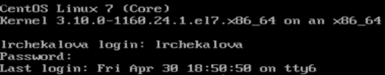
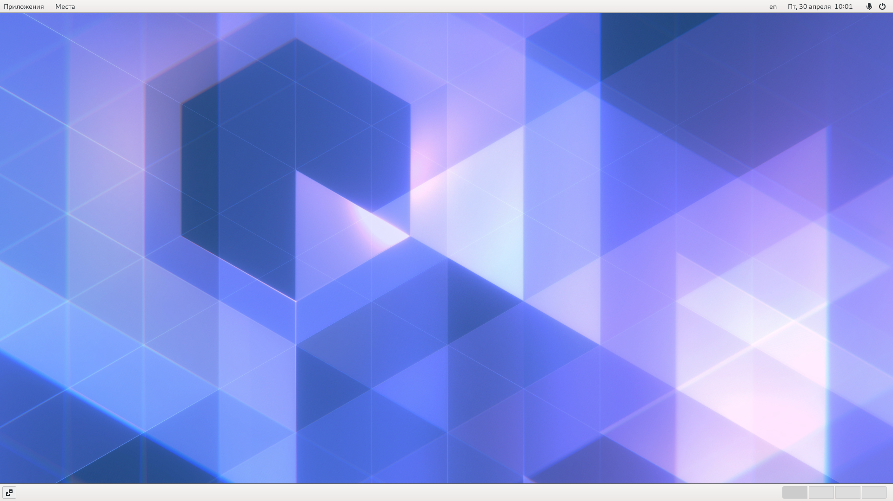
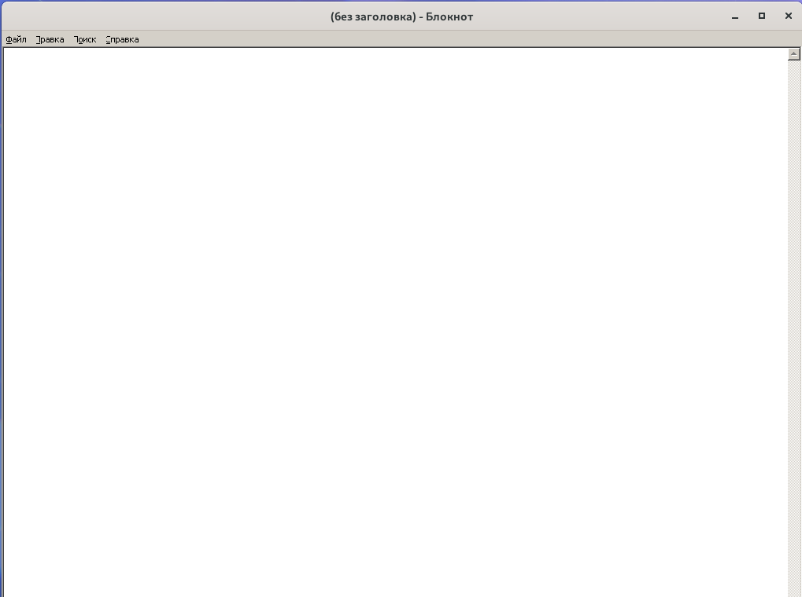

---
# Front matter
lang: ru-RU
title: "Отчет по лабораторой работе №4"
author: "Чекалова Лилия Руслановна"

# Formatting
toc-title: "Содержание"
toc: true # Table of contents
toc_depth: 2
lof: true # List of figures
fontsize: 12pt
linestretch: 1.5
papersize: a4paper
documentclass: scrreprt
polyglossia-lang: russian
polyglossia-otherlangs: english
mainfont: PT Serif
romanfont: PT Serif
sansfont: PT Sans
monofont: PT Mono
mainfontoptions: Ligatures=TeX
romanfontoptions: Ligatures=TeX
sansfontoptions: Ligatures=TeX,Scale=MatchLowercase
monofontoptions: Scale=MatchLowercase
indent: true
pdf-engine: lualatex
header-includes:
  - \linepenalty=10 # the penalty added to the badness of each line within a paragraph (no associated penalty node) Increasing the value makes tex try to have fewer lines in the paragraph.
  - \interlinepenalty=0 # value of the penalty (node) added after each line of a paragraph.
  - \hyphenpenalty=50 # the penalty for line breaking at an automatically inserted hyphen
  - \exhyphenpenalty=50 # the penalty for line breaking at an explicit hyphen
  - \binoppenalty=700 # the penalty for breaking a line at a binary operator
  - \relpenalty=500 # the penalty for breaking a line at a relation
  - \clubpenalty=150 # extra penalty for breaking after first line of a paragraph
  - \widowpenalty=150 # extra penalty for breaking before last line of a paragraph
  - \displaywidowpenalty=50 # extra penalty for breaking before last line before a display math
  - \brokenpenalty=100 # extra penalty for page breaking after a hyphenated line
  - \predisplaypenalty=10000 # penalty for breaking before a display
  - \postdisplaypenalty=0 # penalty for breaking after a display
  - \floatingpenalty = 20000 # penalty for splitting an insertion (can only be split footnote in standard LaTeX)
  - \raggedbottom # or \flushbottom
  - \usepackage{float} # keep figures where there are in the text
  - \floatplacement{figure}{H} # keep figures where there are in the text
---

# Цель работы

Познакомиться с операционной системой Linux, получить практические навыки работы с консолью и некоторыми графическими менеджерами рабочих столов операционной
системы.

# Выполнение лабораторной работы

Загружаю компьютер и запускаю текстовую консоль с помощью сочетания клавиш ctrl + alt + f1. На моем компьютере доступно 6 текстовых консолей (рис. -@fig:001)

{ #fig:001 width=70% }

Перемещаюсь между текстовыми консолями, использую клавиши alt + f2 (f3...f6) (рис. -@fig:002) (рис. -@fig:003) 

{ #fig:002 width=70% }

{ #fig:003 width=70% }

Регистрируюсь в текстовой консоли операционной системы, используя в качестве логина lrchekalova. При вводе пароля никакие символы не отображаются (рис. -@fig:004)

{ #fig:004 width=70% }

Завершаю консольный сеанс, используя команду logout (рис. -@fig:005)

{ #fig:005 width=70% }

Переключаюсь на графический интерфейс с помощью комбинации клавиш ctrl + alt + f7 (рис. -@fig:006)

{ #fig:006 width=70% }

Изучаю менеджер рабочих столов. По умолчанию стоит Классический GNOME (рис. -@fig:007) (рис. -@fig:008) (рис. -@fig:009)

{ #fig:007 width=70% }

{ #fig:008 width=70% }

{ #fig:009 width=70% }

Поочередно регистрируюсь в разных графических менеджерах рабочих столов (GNOME, MATE, XFCE) и оконных менеджерах (Openbox) (рис. -@fig:010) (рис. -@fig:011) (рис. -@fig:012) (рис. -@fig:13) (рис. -@fig:14) 

{ #fig:010 width=70% }

{ #fig:011 width=70% }

{ #fig:012 width=70% }

{ #fig:013 width=70% }

{ #fig:014 width=70% }

Изучаю список установленных программ, запуская браузер, текстовой редактор, текстовой процессор и эмулятор консоли (рис. -@fig:015) (рис. -@fig:016) (рис. -@fig:017) (рис. -@fig:018)

{ #fig:015 width=70% }

{ #fig:016 width=70% }

{ #fig:017 width=70% }

{ #fig:018 width=70% }

# Выводы

После выполнения данной лабораторной работы я познакомилась в системой Linux и научилась работать с консолью.