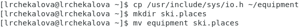

---
# Front matter
lang: ru-RU
title: "Отчет по лабораторной работе №6"
subtitle: "Дисциплина: Операционные системы"
author: "Чекалова Лилия Руслановна, ст.б 1032201654"

# Formatting
toc-title: "Содержание"
toc: true # Table of contents
toc_depth: 2
lof: true # List of figures
fontsize: 12pt
linestretch: 1.5
papersize: a4paper
documentclass: scrreprt
polyglossia-lang: russian
polyglossia-otherlangs: english
mainfont: PT Serif
romanfont: PT Serif
sansfont: PT Sans
monofont: PT Mono
mainfontoptions: Ligatures=TeX
romanfontoptions: Ligatures=TeX
sansfontoptions: Ligatures=TeX,Scale=MatchLowercase
monofontoptions: Scale=MatchLowercase
indent: true
pdf-engine: lualatex
header-includes:
  - \linepenalty=10 # the penalty added to the badness of each line within a paragraph (no associated penalty node) Increasing the value makes tex try to have fewer lines in the paragraph.
  - \interlinepenalty=0 # value of the penalty (node) added after each line of a paragraph.
  - \hyphenpenalty=50 # the penalty for line breaking at an automatically inserted hyphen
  - \exhyphenpenalty=50 # the penalty for line breaking at an explicit hyphen
  - \binoppenalty=700 # the penalty for breaking a line at a binary operator
  - \relpenalty=500 # the penalty for breaking a line at a relation
  - \clubpenalty=150 # extra penalty for breaking after first line of a paragraph
  - \widowpenalty=150 # extra penalty for breaking before last line of a paragraph
  - \displaywidowpenalty=50 # extra penalty for breaking before last line before a display math
  - \brokenpenalty=100 # extra penalty for page breaking after a hyphenated line
  - \predisplaypenalty=10000 # penalty for breaking before a display
  - \postdisplaypenalty=0 # penalty for breaking after a display
  - \floatingpenalty = 20000 # penalty for splitting an insertion (can only be split footnote in standard LaTeX)
  - \raggedbottom # or \flushbottom
  - \usepackage{float} # keep figures where there are in the text
  - \floatplacement{figure}{H} # keep figures where there are in the text
---

# Цель работы

Ознакомление с файловой системой Linux, её структурой, именами и содержанием каталогов. Приобретение практических навыков по применению команд для работы с файлами и каталогами, по управлению процессами (и работами), по проверке использования диска и обслуживанию файловой системы.

# Выполнение лабораторной работы

Выполняю примеры, приведенные в теоретической части лабораторной работы (рис. -@fig:001) (рис. -@fig:002)

{ #fig:001 width=70% }

{ #fig:002 width=70% }

Копирую в домашний каталог файл /usr/include/sys/io.h под названием equipment с помощью команды cp. Создаю в домашней директории каталог ski.places командой mkdir и перемещаю в него файл equipment командой mv (рис. -@fig:003)

{ #fig:003 width=70% }

Переименовываю equipment в equiplist с помощью команды mv. Создаю в домашней директории файл abc1 командой touch и переношу его в ski.places под именем equiplist2. Создаю в ski.places подкаталог equipment и переношу туда equiplist и equiplist2. Создаю в домашнем каталоге папку newdir и перемещаю ее в ski.places под именем plans (рис. -@fig:004)

{ #fig:004 width=70% }

Создаю в домашней директории каталоги australia и play и файлы my_os и feathers. С помощью команды chmod изменяю права доступа для владельца, группы и остальных (рис. -@fig:005)

{ #fig:005 width=70% }

Просматриваю содержимое файла /etc/passwd с помощью команды cat (рис. -@fig:006)

{ #fig:006 width=70% }

Копирую файл feathers в файл file.old, перемещаю его в каталог play. Копирую каталог play в каталог fun командой cp с опцией -r для рекурсивного копирования (рис. -@fig:007)

{ #fig:007 width=70% }

Перемещаю каталог fun в каталог play под именем games. Лишаю владельца файла feathers права на чтение командой chmod с опциями u-r. При попытке просмотра файла feathers командой cat выведется сообщение о том, что мне отказано в доступе. То же самое произойдет при попытке копирования этого файла. Возвращаю владельцу файла feathers право на чтение командой chmod u+r. Лишаю владельца каталога play права на выполнение с помощью команды chmod u-x. При попытке перейти в этот каталог командой cd выведется сообщение об отказе в доступе. Возвращаю владельцу каталога play право навыполнение командой chmod u+x (рис. -@fig:008)

{ #fig:008 width=70% }

Читаю man по команде mount. Эта команда присоединяет найденные на устройстве файловые системы к общему файловому дереву. Вызов этой команды без дополнительных опций позволяет просмотреть используемые на устройстве файловые системы: их тип, соответствующие им точки монтирования и параметры монтирования (рис. -@fig:009)

{ #fig:009 width=70% }

Например, в первой строке результата выполнения команды mount sysfs - имя устройства, /sys - точки монтирования, sysfs - тип файловой системы, а (rw,nosuid,nodev,noexec,relatime,seclabel) - параметры монтирования (рис. -@fig:010)

{ #fig:010 width=70% }

Читаю man по команде fsck. Эта команда проверяет и восстанавливает целостность указанной файловой системы, например, /dev/sda1 в строке fsck /dev/sda1 обозначает имя устройства, над файловыми системами которого выполняется команда. При отсутствии дополнительных параметров команда по умолчанию проверяет файловые системы в /etc/fstab (рис. -@fig:011)

{ #fig:011 width=70% }

Читаю man по команде mkfs. Эта команда создает на устройстве новую файловую систему, обычно на жестком диске. В параметрах команды можно указать тип создаваемой файловой системы, расположение и размер (рис. -@fig:012)

{ #fig:012 width=70% }

Читаю man по команде kill. Эта команда завершает указанный процесс, подавая ему сигнал. По умолчанию она посылает сигнал TERM; если процесс не принимает этот сигнал, то команда его прекращает (рис. -@fig:013)

{ #fig:013 width=70% }

# Выводы

После выполнения данной лабораторной работы я познакомилась с файловой системой Linux и научилась применять команды для работы с файлами и каталогами, а также команды по управлению процессами, проверке использования диска и обслуживанию файловой системы, такие как cat, touch, cp, mv, chmod, mount и другими.

# Библиография

1. Курячий Г.В. Операционная система UNIX. - М.: Интуит.Ру, 2004
2. Робачевский А.М. Операционная система UNIX. - СПб.: БХВ-Петербург, 2002