---
# Front matter
lang: ru-RU
title: "Отчет по лабораторной работе №7"
subtitle: "Дисциплина: Операционные системы"
author: "Чекалова Лилия Руслановна, ст.б. 1032201654"

# Formatting
toc-title: "Содержание"
toc: true # Table of contents
toc_depth: 2
lof: true # List of figures
fontsize: 12pt
linestretch: 1.5
papersize: a4paper
documentclass: scrreprt
polyglossia-lang: russian
polyglossia-otherlangs: english
mainfont: PT Serif
romanfont: PT Serif
sansfont: PT Sans
monofont: PT Mono
mainfontoptions: Ligatures=TeX
romanfontoptions: Ligatures=TeX
sansfontoptions: Ligatures=TeX,Scale=MatchLowercase
monofontoptions: Scale=MatchLowercase
indent: true
pdf-engine: lualatex
header-includes:
  - \linepenalty=10 # the penalty added to the badness of each line within a paragraph (no associated penalty node) Increasing the value makes tex try to have fewer lines in the paragraph.
  - \interlinepenalty=0 # value of the penalty (node) added after each line of a paragraph.
  - \hyphenpenalty=50 # the penalty for line breaking at an automatically inserted hyphen
  - \exhyphenpenalty=50 # the penalty for line breaking at an explicit hyphen
  - \binoppenalty=700 # the penalty for breaking a line at a binary operator
  - \relpenalty=500 # the penalty for breaking a line at a relation
  - \clubpenalty=150 # extra penalty for breaking after first line of a paragraph
  - \widowpenalty=150 # extra penalty for breaking before last line of a paragraph
  - \displaywidowpenalty=50 # extra penalty for breaking before last line before a display math
  - \brokenpenalty=100 # extra penalty for page breaking after a hyphenated line
  - \predisplaypenalty=10000 # penalty for breaking before a display
  - \postdisplaypenalty=0 # penalty for breaking after a display
  - \floatingpenalty = 20000 # penalty for splitting an insertion (can only be split footnote in standard LaTeX)
  - \raggedbottom # or \flushbottom
  - \usepackage{float} # keep figures where there are in the text
  - \floatplacement{figure}{H} # keep figures where there are in the text
---

# Цель работы

Ознакомление с инструментами поиска файлов и фильтрации текстовых данных, приобретение практических навыков по управлению процессами (и заданиями), проверке использования диска и обслуживанию файловых систем.

# Выполнение лабораторной работы

Осуществив вход в систему под своим именем, записываю в файл file.txt названия файлов из каталога /etc, используя команду ls для просмотра содержимого каталога и ">" для перенаправления вывода в файл. Также с помощью ">>" дописала в этот же файл содержимое домашнего каталога (рис. -@fig:001)

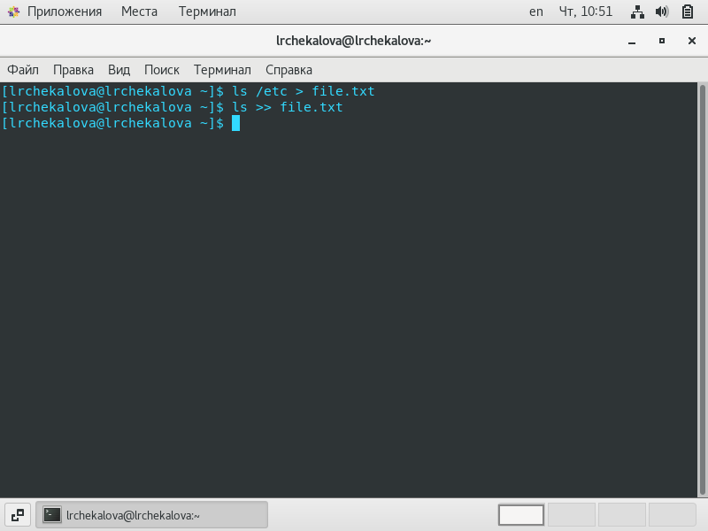{ #fig:001 width=70% }

Вывожу имена всех файлов из file.txt, имеющих расширение ".conf", используя команду grep (рис. -@fig:002)

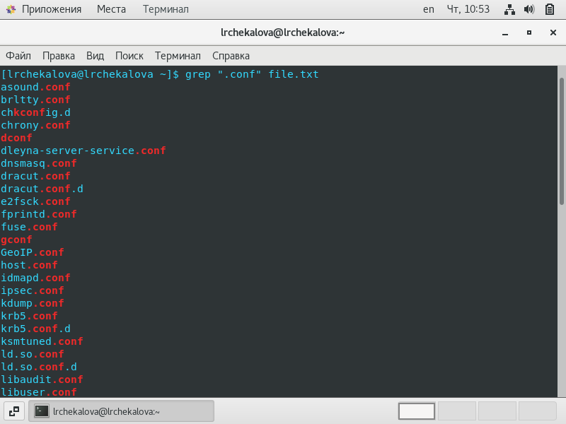{ #fig:002 width=70% }

Записываю полученную информацию в новый файл conf.txt, пользуясь символом ">" (рис. -@fig:003)

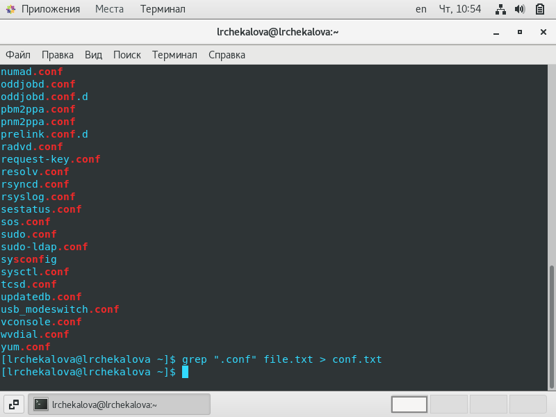{ #fig:003 width=70% }

Определяю, имена каких файлов в домашнем каталоге начинаются с символа "c". Это можно сделать двумя способами: осуществить поиск по домашнему каталогу командой find (позднее, прочитав справку, я нашла опцию, которая бы подошла к этой задаче, но в данный момент я выполняла поиск не только по домашнему каталогу, но и по всем подкаталогам) и воспользоваться цепочкой команд ls и grep. Второй способ показал все файлы, в имени которых есть "c", а не только в начале (рис. -@fig:004) (рис. -@fig:005)

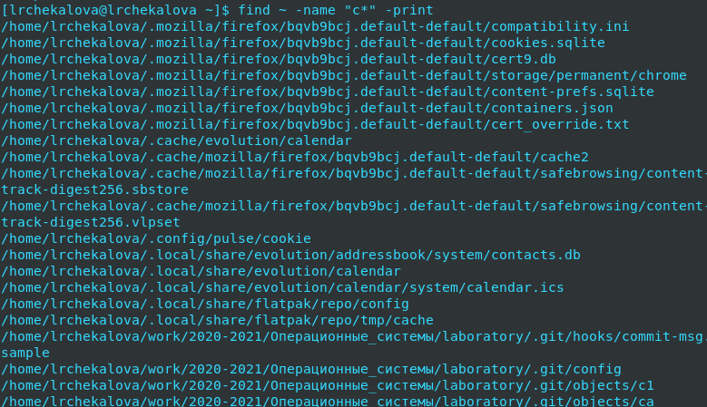{ #fig:004 width=70% }

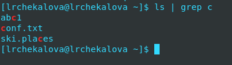{ #fig:005 width=70% }

Вывожу постранично имена файлов из каталога /etc, начинающиеся с символа "h", с помощью команд find и less (рис. -@fig:006) (рис. -@fig:007)

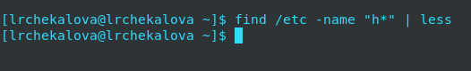{ #fig:006 width=70% }

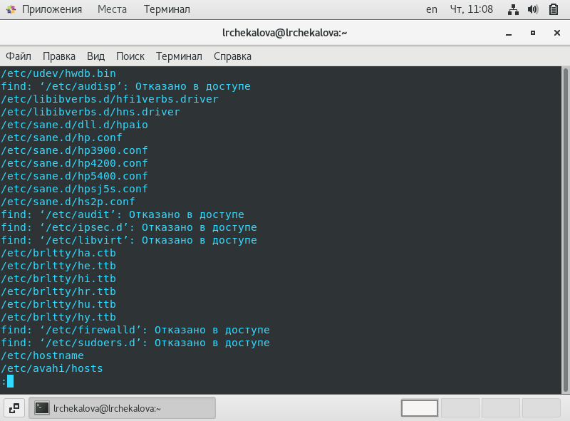{ #fig:007 width=70% }

Запускаю фоновый процесс записи в файл ~/logfile файлов, имена которых начинаются с "log", с помощью & (амперсанда), переводящего процесс в фоновый режим (рис. -@fig:008)

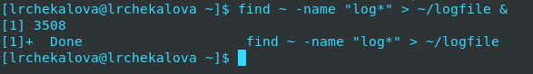{ #fig:008 width=70% }

Удаляю файл ~/logfile с помощью опции -exec rm "{}" \; команды find, предварительно проверив, что этот файл - единственный, выдающийся при поиске. Проверяю успешность удаления с помощью цепочки команд ls | grep (рис. -@fig:009)

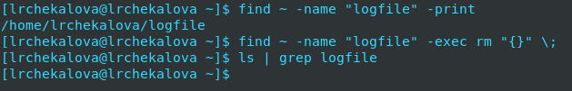{ #fig:009 width=70% }

Запускаю фоновым процессом редактор gedit, определяю его идентификатор процесса с помощью цепочки команд ps | grep. Этот идентификатор можно было определить, посмотрев на строчку выше - после запуска процесса в фоновом режиме, на экран выводится присвоенный этому процессу идентификатор (рис. -@fig:010)

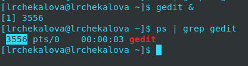{ #fig:010 width=70% }

Читаю справку по команде kill и использую ее для завершения процесса gedit, указав его идентификатор (рис. -@fig:011) (рис. -@fig:012) 

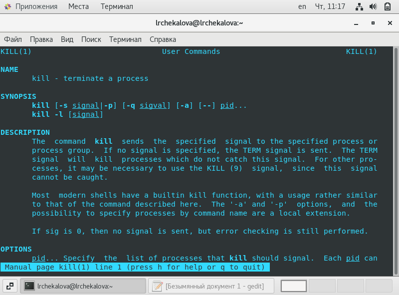{ #fig:011 width=70% }

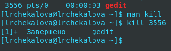{ #fig:012 width=70% }

Получаю подробную информацию о командах df (показывает свободное место в файловой системе) и du (показывает занятое каждым файлом и каталогом место) с помощью команды man. Обращаю внимание на опцию -h, выводящую информацию в понятных человеку единицах измерения (Кб, Мб, Гб) (рис. -@fig:013) (рис. -@fig:014)

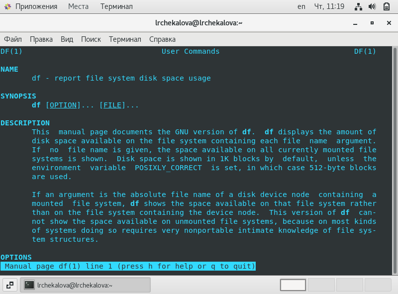{ #fig:013 width=70% }

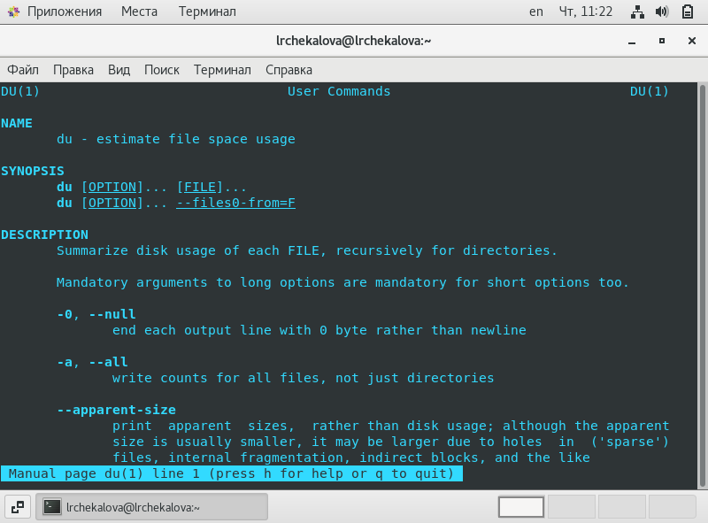{ #fig:014 width=70% }

Выполняю команду df (рис. -@fig:015)

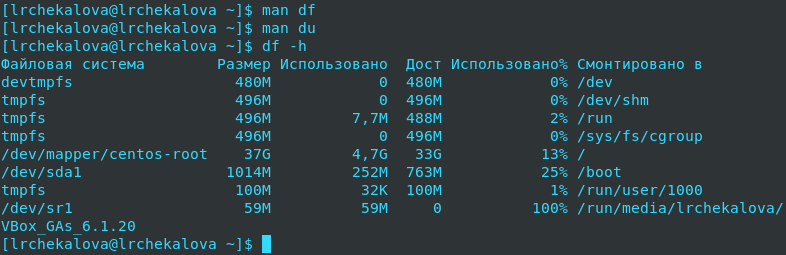{ #fig:015 width=70% }

Выполняю команду du (рис. -@fig:016)

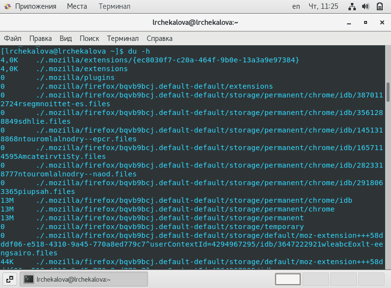{ #fig:016 width=70% }

Читаю справку по команде find, чтобы вывести имена всех директорий, находящихся в домашнем каталоге (рис. -@fig:017)

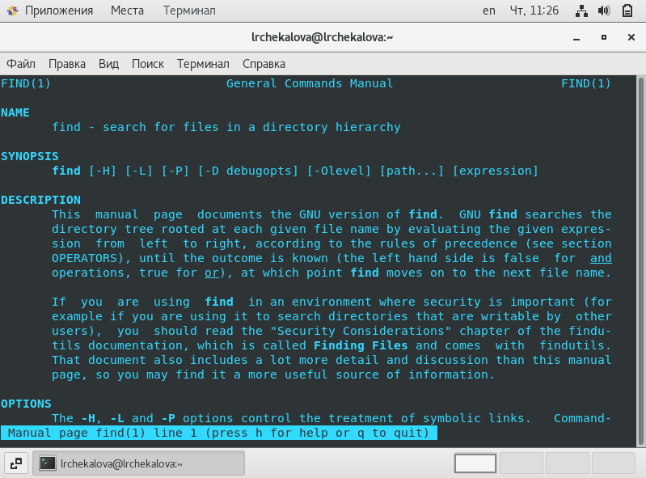{ #fig:017 width=70% }

Применяю команду find с опциями -maxdepth 1 (показывает, что поиск нужно вести только в текущем каталоге) и -type d (показывает, что поиск ведется только по директориям) (рис. -@fig:018)

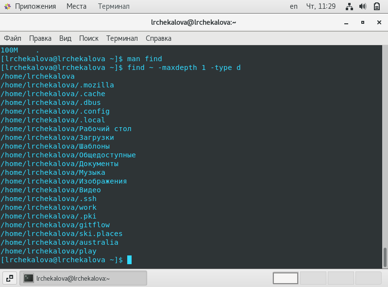{ #fig:018 width=70% }

# Выводы

После выполнения данной лабораторной работы я научилась направлять вывод в файл, используя ">" и ">>", ознакомилась с инструментом поиска файлов find, инструментом фильтрации текстовых данных grep и инструментом объединения простых команд в цепочки - конвейером (pipe), а также приобрела навыки по управлению процессами с помощью & (амперсанда) и команд ps и kill и проверке использования диска и обслуживанию файловых систем с помощью команд df и du.