---
# Front matter
lang: ru-RU
title: "Отчет по лабораторной работе №9"
subtitle: "Дисциплина: Операционные системы"
author: "Чекалова Лилия Руслановна, ст.б. 1032201654"

# Formatting
toc-title: "Содержание"
toc: true # Table of contents
toc_depth: 2
lof: true # List of figures
fontsize: 12pt
linestretch: 1.5
papersize: a4paper
documentclass: scrreprt
polyglossia-lang: russian
polyglossia-otherlangs: english
mainfont: PT Serif
romanfont: PT Serif
sansfont: PT Sans
monofont: PT Mono
mainfontoptions: Ligatures=TeX
romanfontoptions: Ligatures=TeX
sansfontoptions: Ligatures=TeX,Scale=MatchLowercase
monofontoptions: Scale=MatchLowercase
indent: true
pdf-engine: lualatex
header-includes:
  - \linepenalty=10 # the penalty added to the badness of each line within a paragraph (no associated penalty node) Increasing the value makes tex try to have fewer lines in the paragraph.
  - \interlinepenalty=0 # value of the penalty (node) added after each line of a paragraph.
  - \hyphenpenalty=50 # the penalty for line breaking at an automatically inserted hyphen
  - \exhyphenpenalty=50 # the penalty for line breaking at an explicit hyphen
  - \binoppenalty=700 # the penalty for breaking a line at a binary operator
  - \relpenalty=500 # the penalty for breaking a line at a relation
  - \clubpenalty=150 # extra penalty for breaking after first line of a paragraph
  - \widowpenalty=150 # extra penalty for breaking before last line of a paragraph
  - \displaywidowpenalty=50 # extra penalty for breaking before last line before a display math
  - \brokenpenalty=100 # extra penalty for page breaking after a hyphenated line
  - \predisplaypenalty=10000 # penalty for breaking before a display
  - \postdisplaypenalty=0 # penalty for breaking after a display
  - \floatingpenalty = 20000 # penalty for splitting an insertion (can only be split footnote in standard LaTeX)
  - \raggedbottom # or \flushbottom
  - \usepackage{float} # keep figures where there are in the text
  - \floatplacement{figure}{H} # keep figures where there are in the text
---

# Цель работы

Знакомство с операционной системой Linux и получение практических навыков работы с редактором vi, установленным по умолчанию практически во всех дистрибутивах.

# Выполнение лабораторной работы

Создаю каталог с именем ~/work/os/lab09 с помощью команды mkdir -p, перехожу в него с помощью команды cd, вызываю оттуда редактор vi и создаю файл hello.sh (рис. -@fig:001)

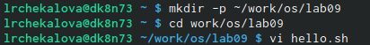{ #fig:001 width=70% }

Перехожу в режим вставки нажатием клавиши i и ввожу текст (рис. -@fig:002)

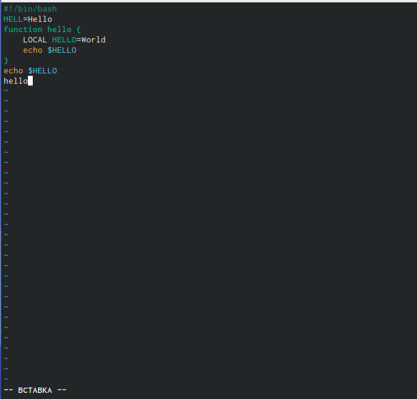{ #fig:002 width=70% }

Нажатием клавиши esc перехожу в командный режим (рис. -@fig:003)

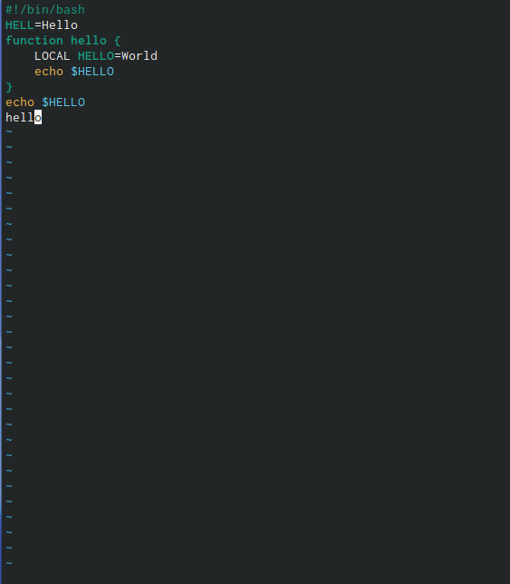{ #fig:003 width=70% }

С помощью сочетания клавиш shift-: перехожу в режим последний строки, сохраняю изменения в файле и выхожу с помощью команды wq (w - write - записать в файл, q - quit - выйти) (рис. -@fig:004)

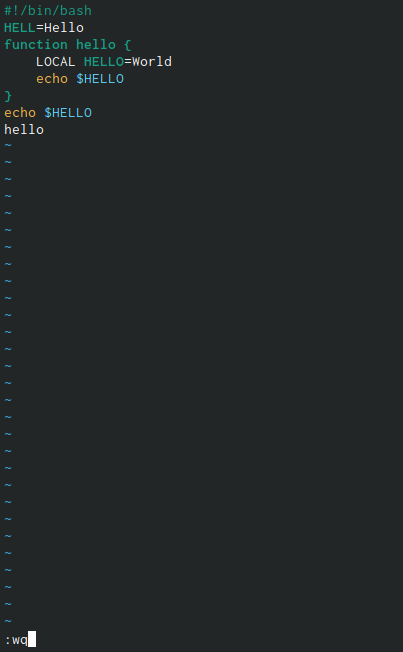{ #fig:004 width=70% }

С помощью команды chmod +x делаю hello.sh исполняемым файлом (рис. -@fig:005)

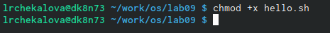{ #fig:005 width=70% }

Открываю уже существующий файл hello.sh в vi для редактирования, указав полный путь к файлу (рис. -@fig:006)

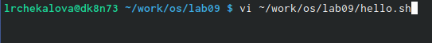{ #fig:006 width=70% }

Устанавливаю курсор в конец слова HELL во второй строке (рис. -@fig:007)

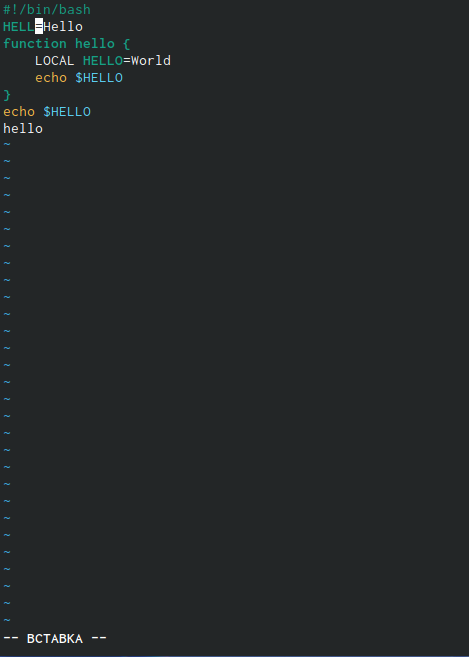{ #fig:007 width=70% }

Перехожу в режим вставки и изменяю это слово на HELLO (рис. -@fig:008)

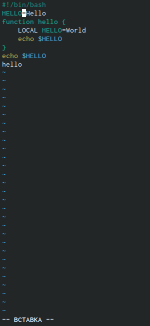{ #fig:008 width=70% }

Возвращаюсь в командный режим клавишей esc, ставлю курсор на четвертую строку и удаляю слово LOCAL командой dw (рис. -@fig:009)

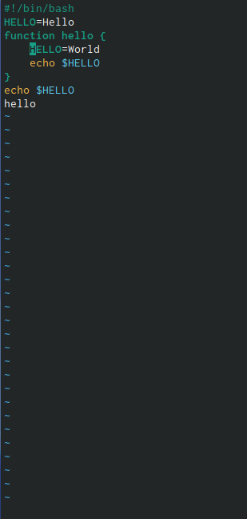{ #fig:009 width=70% }

Вновь перехожу в режим вставки и ввожу на это место текст local (рис. -@fig:010)

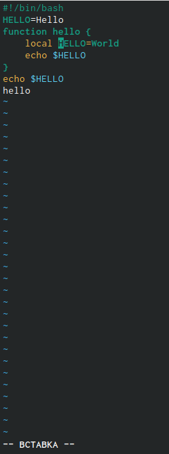{ #fig:010 width=70% }

Копирую строчку echo $HELLO клавишей Y, перехожу в конец файла и вставляю ее туда командой p - вставка текста из буфера после курсора (рис. -@fig:011)

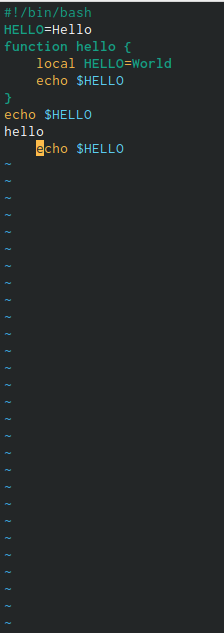{ #fig:011 width=70% }

Удаляю последнюю строку командой dd (рис. -@fig:012)

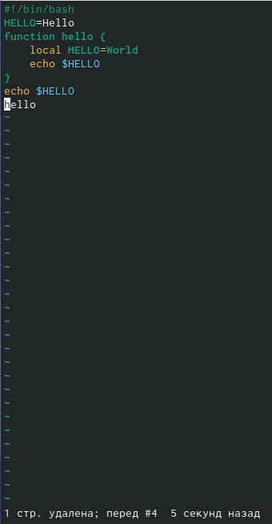{ #fig:012 width=70% }

Отменяю последнее действие клавишей u (рис. -@fig:013)

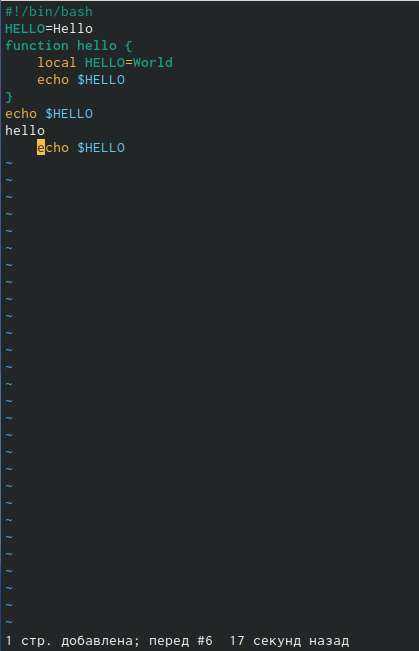{ #fig:013 width=70% }

Перехожу в режим последней строки, записываю изменения в файл и выхожу с помощью команды wq (рис. -@fig:014)

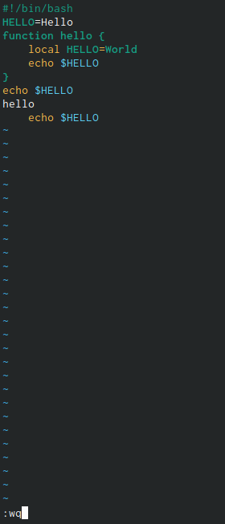{ #fig:014 width=70% }

# Выводы

После выполнения данной лабораторной работы я научилась с помощью комбинаций клавиш копировать, вставлять и удалять фрагменты текста, переключаться между режимами редактора vi, отменять последние действия и сохранять файлы.

# Библиография

1. Работа с редактором vi: https://docs.altlinux.org/ru-RU/archive/2.3/html-single/junior/alt-docs-extras-linuxnovice/ch02s10.html
2. Теоретические материалы к лабораторной работе: https://esystem.rudn.ru/pluginfile.php/1142226/mod_resource/content/2/006-lab_vi.pdf