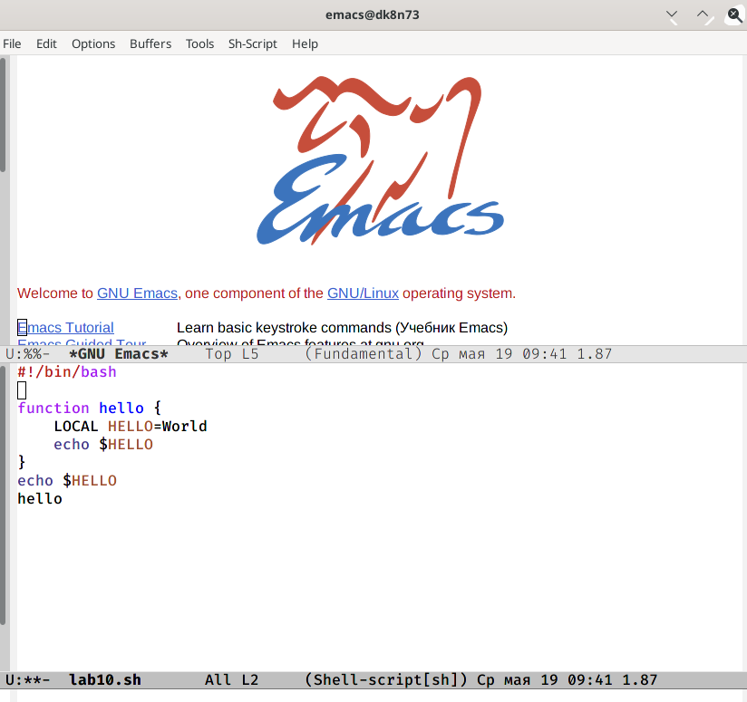
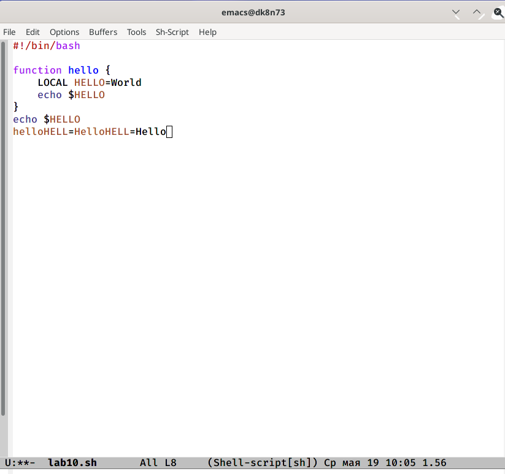

---
# Front matter
lang: ru-RU
title: "Отчет по лабораторной работе №10"
subtitle: "Дисциплина: Операционные системы"
author: "Чекалова Лилия Руслановна, ст.б. 1032201654"

# Formatting
toc-title: "Содержание"
toc: true # Table of contents
toc_depth: 2
lof: true # List of figures
fontsize: 12pt
linestretch: 1.5
papersize: a4paper
documentclass: scrreprt
polyglossia-lang: russian
polyglossia-otherlangs: english
mainfont: PT Serif
romanfont: PT Serif
sansfont: PT Sans
monofont: PT Mono
mainfontoptions: Ligatures=TeX
romanfontoptions: Ligatures=TeX
sansfontoptions: Ligatures=TeX,Scale=MatchLowercase
monofontoptions: Scale=MatchLowercase
indent: true
pdf-engine: lualatex
header-includes:
  - \linepenalty=10 # the penalty added to the badness of each line within a paragraph (no associated penalty node) Increasing the value makes tex try to have fewer lines in the paragraph.
  - \interlinepenalty=0 # value of the penalty (node) added after each line of a paragraph.
  - \hyphenpenalty=50 # the penalty for line breaking at an automatically inserted hyphen
  - \exhyphenpenalty=50 # the penalty for line breaking at an explicit hyphen
  - \binoppenalty=700 # the penalty for breaking a line at a binary operator
  - \relpenalty=500 # the penalty for breaking a line at a relation
  - \clubpenalty=150 # extra penalty for breaking after first line of a paragraph
  - \widowpenalty=150 # extra penalty for breaking before last line of a paragraph
  - \displaywidowpenalty=50 # extra penalty for breaking before last line before a display math
  - \brokenpenalty=100 # extra penalty for page breaking after a hyphenated line
  - \predisplaypenalty=10000 # penalty for breaking before a display
  - \postdisplaypenalty=0 # penalty for breaking after a display
  - \floatingpenalty = 20000 # penalty for splitting an insertion (can only be split footnote in standard LaTeX)
  - \raggedbottom # or \flushbottom
  - \usepackage{float} # keep figures where there are in the text
  - \floatplacement{figure}{H} # keep figures where there are in the text
---

# Цель работы

Знакомство с операционной системой Linux и получение практических навыков работы с редактором Emacs.

# Выполнение лабораторной работы

Открываю редактор Emacs (рис. -@fig:001)

{ #fig:001 width=70% }

Создаю файл lab10.sh с помощью комбинации клавиш ctrl-x ctrl-f (рис. -@fig:002)

{ #fig:002 width=70% }

Ввожу текст (рис. -@fig:003)

{ #fig:003 width=70% }

Сохраняю файл с помощью комбинации клавиш ctrl-x ctrl-s (рис. -@fig:004)

{ #fig:004 width=70% }

Начинаю редактирование файла: вырезаю целую строку командой ctrl-k (рис. -@fig:005)

{ #fig:005 width=70% }

Вставляю эту строку в конец файла командой ctrl-y (рис. -@fig:006)

{ #fig:006 width=70% }

Выделяю область текста комбинацией клавиш ctrl-space и стрелочками (рис. -@fig:007)

{ #fig:007 width=70% }

Копирую фрагмент текста в буфер обмена командой alt-w (alt здесь используется вместо клавиши meta) и вставляю его в конец файла командой ctrl-y (рис. -@fig:008)

{ #fig:008 width=70% }

Вновь выделяю область текста и вырезаю его комбинацией клавиш ctrl-w (рис. -@fig:009)

{ #fig:009 width=70% }

Отменяю последнее действие командой ctrl-/ (рис. -@fig:010)

{ #fig:010 width=70% }

Перемещаю курсор в начало строки командой ctrl-a (рис. -@fig:011)

{ #fig:011 width=70% }

Перемещаю курсор в конец строки командой ctrl-e (рис. -@fig:012)

{ #fig:012 width=70% }

Перемещаю курсор в начало буфера командой alt-shift-< (рис. -@fig:013)

{ #fig:013 width=70% }

Перемещаю курсор в конец буфера командой alt-shift-> (рис. -@fig:014)

{ #fig:014 width=70% }

Вывожу список активных буферов на экран командой ctrl-x ctrl-b (рис. -@fig:015)

{ #fig:015 width=70% }

Перемещаюсь в окно со списком буферов командой ctrl-x o и переключаюсь на другой буфер (рис. -@fig:016)

{ #fig:016 width=70% }

Закрываю это окно комбинацией клавиш ctrl-x 0 (рис. -@fig:017)

{ #fig:017 width=70% }

Переключаюсь между буферами с помощью команды ctrl-x b (рис. -@fig:018)

{ #fig:018 width=70% }

Разделяю фрейм на 4 части: на два окна по вертикали с помощью команды ctrl-x 3 и затем каждое окно на две части по горизонатли командой ctrl-x 2 (рис. -@fig:019)

{ #fig:019 width=70% }

Открываю в каждом окне новый буфер с помощью комбинации клавиш ctrl-x ctrl-f (рис. -@fig:020)

{ #fig:020 width=70% }

В каждый из буферов ввожу несколько строчек текста (рис. -@fig:021)

{ #fig:021 width=70% }

Переключаюсь в режим поиска с помощью клавиш ctrl-s и осуществляю поиск слова "новый" (рис. -@fig:022)

{ #fig:022 width=70% }

Осуществляю поиск слова "текст" и переключаюсь между результатами поиска клавишами ctrl-s (рис. -@fig:023) (рис. -@fig:024)

{ #fig:023 width=70% }

{ #fig:024 width=70% }

Выхожу из режима поиска командой ctrl-g (рис. -@fig:025)

{ #fig:025 width=70% }

Перехожу в режим поиска и замены комбинацией клавиш alt-shift-%, ввожу слово, которое нужно заменить и нажимаю enter (рис. -@fig:026)

{ #fig:026 width=70% }

Ввожу слово, на которое нужно произвести замену (рис. -@fig:027)

{ #fig:027 width=70% }

На экране выделяется найденный текст (рис. -@fig:028)

{ #fig:028 width=70% }

Подтверждаю замену клавишами shift-! (рис. -@fig:029)

{ #fig:029 width=70% }

Перехожу в другой режим поиска с помощью клавиш alt-s (рис. -@fig:030)

{ #fig:030 width=70% }

Данный режим отличается от ctrl-s тем, что он не выделяет результат цветом, а ставит курсор после найденного слова (рис. -@fig:031)

{ #fig:031 width=70% }

# Выводы

После выполнения данной лабораторной работы я научилась с помощью горячих клавиш создавать файлы, вырезать, вставлять, выделять и копировать фрагменты текста, перемещать курсор, осуществлять поиск и замену, управлять буферами и окнами редактора Emacs.

# Библиография

1. Emacs: основные сочетания клавиш: https://gist.github.com/ulysses4ever/68f8eb09a45f78fd2be096aa03813d78
2. Теоретические материалы к лабораторной работе: https://esystem.rudn.ru/pluginfile.php/1142229/mod_resource/content/3/007-lab_emacs.pdf