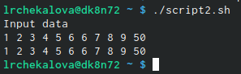

---
# Front matter
lang: ru-RU
title: "Отчет по лабораторной работе №11"
subtitle: "Дисциплина: Операционные системы"
author: "Чекалова Лилия Руслановна, ст.б. 1032201654"

# Formatting
toc-title: "Содержание"
toc: true # Table of contents
toc_depth: 2
lof: true # List of figures
fontsize: 12pt
linestretch: 1.5
papersize: a4paper
documentclass: scrreprt
polyglossia-lang: russian
polyglossia-otherlangs: english
mainfont: PT Serif
romanfont: PT Serif
sansfont: PT Sans
monofont: PT Mono
mainfontoptions: Ligatures=TeX
romanfontoptions: Ligatures=TeX
sansfontoptions: Ligatures=TeX,Scale=MatchLowercase
monofontoptions: Scale=MatchLowercase
indent: true
pdf-engine: lualatex
header-includes:
  - \linepenalty=10 # the penalty added to the badness of each line within a paragraph (no associated penalty node) Increasing the value makes tex try to have fewer lines in the paragraph.
  - \interlinepenalty=0 # value of the penalty (node) added after each line of a paragraph.
  - \hyphenpenalty=50 # the penalty for line breaking at an automatically inserted hyphen
  - \exhyphenpenalty=50 # the penalty for line breaking at an explicit hyphen
  - \binoppenalty=700 # the penalty for breaking a line at a binary operator
  - \relpenalty=500 # the penalty for breaking a line at a relation
  - \clubpenalty=150 # extra penalty for breaking after first line of a paragraph
  - \widowpenalty=150 # extra penalty for breaking before last line of a paragraph
  - \displaywidowpenalty=50 # extra penalty for breaking before last line before a display math
  - \brokenpenalty=100 # extra penalty for page breaking after a hyphenated line
  - \predisplaypenalty=10000 # penalty for breaking before a display
  - \postdisplaypenalty=0 # penalty for breaking after a display
  - \floatingpenalty = 20000 # penalty for splitting an insertion (can only be split footnote in standard LaTeX)
  - \raggedbottom # or \flushbottom
  - \usepackage{float} # keep figures where there are in the text
  - \floatplacement{figure}{H} # keep figures where there are in the text
---

# Цель работы

Изучить основы программирования в оболочке ОС UNIX/Linux и научиться писать небольшие командные файлы.

# Выполнение лабораторной работы

Читаю справку по команде tar, чтобы понять, какая у нее структура (рис. -@fig:001)

{ #fig:001 width=70% }

Пишу скрипт, создающий при запуске резервную копию самого себя в директорию backup, при этом файл врхивируется tar. Для этого в переменную backup_name записываю название резервного файла, копирую текущий файл в резервный с помощью команды cp и передаю резервный файл команде tar для архивирования (рис. -@fig:002)

{ #fig:002 width=70% }

С помощью команды chmod +x изменяю у командного файла право на исполнение (рис. -@fig:003)

{ #fig:003 width=70% }

Запускаю командный файл командой ./script.sh (рис. -@fig:004)

{ #fig:004 width=70% }

В файлах проверяю успешность создания копии - в папке backup появился нужный нам архив lab11.tar (рис. -@fig:005)

{ #fig:005 width=70% }

Пишу командный файл, обрабатывающий произвольное число аргументов, вводимое с командной строки, и распечатывающий их. Для этого вывожу подсказку для пользователя командой echo и использую команду head с опцией -1, чтобы указать, что на вход принимается одна строка (рис. -@fig:006)

{ #fig:006 width=70% }

Изменив файл на исполняемый, запускаю его и ввожу данные с клавиатуры (рис. -@fig:007)

{ #fig:007 width=70% }

Создаю командный файл - аналог ls, сообщающий информацию о каталоге и правах доступа к файлам. Для этого использую цикл for и условный оператор if-elif-else, в котором команда test с разными опциями (-d, -w и -r) проверяет каждый поступающий объект на принадлежность к директориям или определяет права доступа к файлу, а команда echo выводит результат на экран (рис. -@fig:008)

{ #fig:008 width=70% }

Добавляю файлу возможность исполнения и запускаю его (рис. -@fig:009)

{ #fig:009 width=70% }

Пишу командный файл, принимающий на вход формат и название директории и подсчитывающий, сколько в этой директории файлов такого формата. Для этого использую команду find с опциями -maxdepth 1 (ограничивает поиск указанной директорией), -name "*.$format" (критерий поиска - любое имя и определенный формат) и -type f (поиск по файлам). Для подсчета найденных файлов результаты работы find конвейером отправляю в команду wc с опцией -l, считающую количество строчек. Для наглядности вывожу содержимое указанной директории командой ls (рис. -@fig:010)

{ #fig:010 width=70% }

Делаю файл исполняемым, запускаю и произвожу поиск файлов с форматом .sh в текущей директории (рис. -@fig:011)

{ #fig:011 width=70% }

# Выводы

После выполнения данной лабораторной работы я познакомилась с переменными, циклами for и while, условным оператором if-elif-else и командой test и научилась писать небольшие командные файлы.

# Библиография

1. Команда wc в Linux: https://losst.ru/komanda-wc-v-linux
2. Теоретические материалы к лабораторной работе: https://esystem.rudn.ru/pluginfile.php/1142232/mod_resource/content/2/008-lab_shell_prog_1.pdf
3. Циклы BASH: https://losst.ru/tsikly-bash