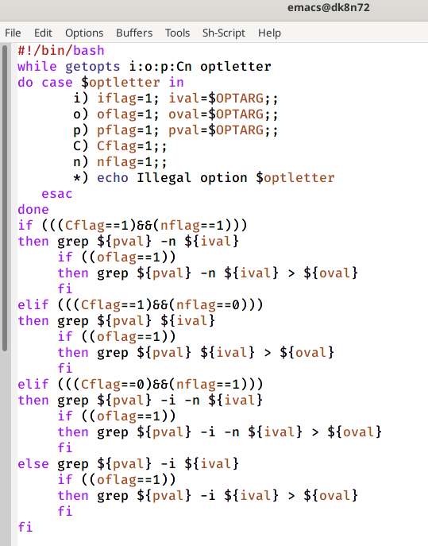
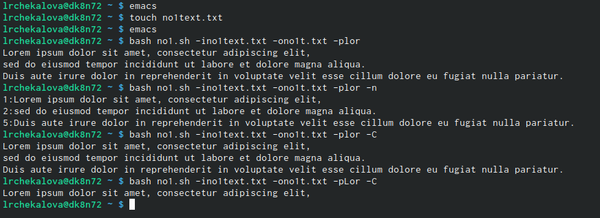

---
# Front matter
lang: ru-RU
title: "Отчет по лабораторной работе №12"
subtitle: "Дисциплина: Операционные системы"
author: "Чекалова Лилия Руслановна, ст.б. 1032201654"

# Formatting
toc-title: "Содержание"
toc: true # Table of contents
toc_depth: 2
lof: true # List of figures
fontsize: 12pt
linestretch: 1.5
papersize: a4paper
documentclass: scrreprt
polyglossia-lang: russian
polyglossia-otherlangs: english
mainfont: PT Serif
romanfont: PT Serif
sansfont: PT Sans
monofont: PT Mono
mainfontoptions: Ligatures=TeX
romanfontoptions: Ligatures=TeX
sansfontoptions: Ligatures=TeX,Scale=MatchLowercase
monofontoptions: Scale=MatchLowercase
indent: true
pdf-engine: lualatex
header-includes:
  - \linepenalty=10 # the penalty added to the badness of each line within a paragraph (no associated penalty node) Increasing the value makes tex try to have fewer lines in the paragraph.
  - \interlinepenalty=0 # value of the penalty (node) added after each line of a paragraph.
  - \hyphenpenalty=50 # the penalty for line breaking at an automatically inserted hyphen
  - \exhyphenpenalty=50 # the penalty for line breaking at an explicit hyphen
  - \binoppenalty=700 # the penalty for breaking a line at a binary operator
  - \relpenalty=500 # the penalty for breaking a line at a relation
  - \clubpenalty=150 # extra penalty for breaking after first line of a paragraph
  - \widowpenalty=150 # extra penalty for breaking before last line of a paragraph
  - \displaywidowpenalty=50 # extra penalty for breaking before last line before a display math
  - \brokenpenalty=100 # extra penalty for page breaking after a hyphenated line
  - \predisplaypenalty=10000 # penalty for breaking before a display
  - \postdisplaypenalty=0 # penalty for breaking after a display
  - \floatingpenalty = 20000 # penalty for splitting an insertion (can only be split footnote in standard LaTeX)
  - \raggedbottom # or \flushbottom
  - \usepackage{float} # keep figures where there are in the text
  - \floatplacement{figure}{H} # keep figures where there are in the text
---

# Цель работы

Изучение основ программированияв оболочке UNIX/Linux, приобретение навыков написания более сложных командных файлов с использованием логических управляющих конструкций и циклов.

# Выполнение лабораторной работы

Пишу командный файл, анализирующий командную строку с ключами -iinputfile (чтение данных из указанного файла), -ooutputfile (запись данных в указанный файл), -pшаблон (поиск по указанному шаблону), -C (различение больших и малых букв) и -n (нумерация строк). Для этого в цикле while использую команду getopts с конструкцией case, а затем проверяю полученные результаты условным оператором if-elif-else, осуществляя командой grep соответствующий поиск и вывод на экран и/или в файл (рис. -@fig:001)

{ #fig:001 width=70% }

Создаю текстовый файл, по которому будет осуществляться поиск, записываю в него фрагмент текста (рис. -@fig:002)

{ #fig:002 width=70% }

Запускаю командный файл с различными опциями и сравниваю полученные результаты. Все ключи работают корректно (рис. -@fig:003)

{ #fig:003 width=70% }

Пишу на языке Си программу, сравнивающую введенное число с нулем: если оно равно нулю, она завершается функцией exit(0), если больше нуля - exit(1), если меньше нуля - exit(2) (рис. -@fig:004)

{ #fig:004 width=70% }

Пишу командный файл, в котором запускаю программу на Си и анализирую ее результат с помощью конструкции case и специальной переменной $?. На основе этого вывожу сообщение о том, которое число было введено (рис. -@fig:005)

{ #fig:005 width=70% }

Запускаю командный файл и проверяю его работу на разных числах (рис. -@fig:006)

{ #fig:006 width=70% }

Пишу командный файл, создающий указанное количество файлов, пронумерованных по порядку от 1, и способный удалять созданные им файлы. Для этого использую команду getopts и, проанализировав результаты ее работы условным оператором if-else, создаю или удаляю указанное количество файлов командами touch и rm (рис. -@fig:007)

{ #fig:007 width=70% }

Запускаю файл с ключом -m3, чтобы он создал три текстовых файла (рис. -@fig:008)

{ #fig:008 width=70% }

Вновь запускаю файл, теперь с ключами -m3 и -d, чтобы удалить созданные файлы (рис. -@fig:009)

{ #fig:009 width=70% }

Пишу командный файл, добавляющий в архив все файлы текущей директории, измененные менее недели назад. Для этого совершаю поиск командой find с опцией -mtime 7, указывающей последнее изменение в днях, и записываю результат в текстовый файл fi1.txt. Затем командой tar с опцией -T добавляю в архив lab12.tar все файлы, указанные в текстовом файле (рис. -@fig:010)

{ #fig:010 width=70% }

Запускаю командный файл и командой ls проверяю наличие созданного архива в папке (рис. -@fig:011)

{ #fig:011 width=70% }

# Выводы

После выполнения данной лабораторной работы я научилась писать более сложные командные файлы с использованием условных конструкций if-elif-else и case, циклов for и while и команды getopts. 

# Библиография

1. Команда find в Linux: https://losst.ru/komanda-find-v-linux
2. Поиск внутри файлов Linux: https://losst.ru/gerp-poisk-vnutri-fajlov-v-linux
3. Теоретические материалы к лабораторной работе: https://esystem.rudn.ru/pluginfile.php/1142232/mod_resource/content/2/008-lab_shell_prog_1.pdf