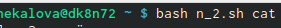

---
# Front matter
lang: ru-RU
title: "Отчет по лабораторной работе №13"
subtitle: "Дисциплина: Операционные системы"
author: "Чекалова Лилия Руслановна, ст.б. 1032201654"

# Formatting
toc-title: "Содержание"
toc: true # Table of contents
toc_depth: 2
lof: true # List of figures
fontsize: 12pt
linestretch: 1.5
papersize: a4paper
documentclass: scrreprt
polyglossia-lang: russian
polyglossia-otherlangs: english
mainfont: PT Serif
romanfont: PT Serif
sansfont: PT Sans
monofont: PT Mono
mainfontoptions: Ligatures=TeX
romanfontoptions: Ligatures=TeX
sansfontoptions: Ligatures=TeX,Scale=MatchLowercase
monofontoptions: Scale=MatchLowercase
indent: true
pdf-engine: lualatex
header-includes:
  - \linepenalty=10 # the penalty added to the badness of each line within a paragraph (no associated penalty node) Increasing the value makes tex try to have fewer lines in the paragraph.
  - \interlinepenalty=0 # value of the penalty (node) added after each line of a paragraph.
  - \hyphenpenalty=50 # the penalty for line breaking at an automatically inserted hyphen
  - \exhyphenpenalty=50 # the penalty for line breaking at an explicit hyphen
  - \binoppenalty=700 # the penalty for breaking a line at a binary operator
  - \relpenalty=500 # the penalty for breaking a line at a relation
  - \clubpenalty=150 # extra penalty for breaking after first line of a paragraph
  - \widowpenalty=150 # extra penalty for breaking before last line of a paragraph
  - \displaywidowpenalty=50 # extra penalty for breaking before last line before a display math
  - \brokenpenalty=100 # extra penalty for page breaking after a hyphenated line
  - \predisplaypenalty=10000 # penalty for breaking before a display
  - \postdisplaypenalty=0 # penalty for breaking after a display
  - \floatingpenalty = 20000 # penalty for splitting an insertion (can only be split footnote in standard LaTeX)
  - \raggedbottom # or \flushbottom
  - \usepackage{float} # keep figures where there are in the text
  - \floatplacement{figure}{H} # keep figures where there are in the text
---

# Цель работы

Изучение основ программирования в оболочке UNIX/Linux, приобретение навыков написания более сложных командных файлов с использованием логических управляющих конструкций и циклов.

# Выполнение лабораторной работы

Пишу командный файл, получающий два значения времени в переменные t1 и t2. Завожу переменные-счетчики времени и организую два цикла while. Первый выполняется в течение периода времени t1, на экран командой echo выводится сообщение "waiting". Второй цикл выполняется в течение промежутка времени t2, на экран выводится сообщение "using". Перед началом второго цикла переменным-счетчикам времени присваиваются новые значения (рис. -@fig:001)

{ #fig:001 width=70% }

Передаю файлу права на исполнение командой chmod +x и запускаю его (рис. -@fig:002)

{ #fig:002 width=70% }

Модифицирую командный файл, переношу выполнение предыдущих циклов в функции waiting и using. Теперь программа принимает на вход три значения: два временных отрезка и значение операции. Если переданная операция равна wait или use выполняется функция waiting или using соответственно. Когда программа получает значение операции exit, она завершает работу (рис. -@fig:003)

{ #fig:003 width=70% }

Запускаю программу, передавав ей значение операции и направляя результат на четвертый терминал (рис. -@fig:004)

{ #fig:004 width=70% }

Просматриваю содержимое каталога /usr/share/man/man1 командой ls (рис. -@fig:005)

{ #fig:005 width=70% }

Пишу командный файл, принимающий на вход имя команды. Если архив или файл с таким именем найден, его содержимое выводится на экран командой less, в противном случае выводится сообщение об ошибке (рис. -@fig:006)

{ #fig:006 width=70% }

Запускаю программу, запрашивая справку о команде cat (рис. -@fig:007)

{ #fig:007 width=70% }

На экран выводится справка по команде cat, находящаяся в архиве cat.1.bz2 (рис. -@fig:008)

{ #fig:008 width=70% }

Пишу командный файл, получающий на вход количество букв последовательности. В цикле for передаю переменной letter значение $RANDOM в диапазоне от 1 до 26 и вывожу на экран соответствующую номеру букву в конструкции case (рис. -@fig:009)

{ #fig:009 width=70% }

Запускаю программу, чтобы получить последовательность из 7 букв латинского алфавита (рис. -@fig:010)

{ #fig:010 width=70% }

# Выводы

После выполнения данной лабораторной работы я научилась писать более сложные командные файлы с использованием условных конструкций if-elif-else и case, циклов for и while и функций. 

# Библиография

1. Machtelt Garrels. Bash Guide For Beginners, 2008
2. Mendel Cooper. Advanced Bash-Scripting Guide, 2004
3. Теоретические материалы к лабораторной работе: https://esystem.rudn.ru/pluginfile.php/1142232/mod_resource/content/2/008-lab_shell_prog_1.pdf