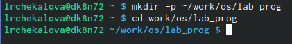
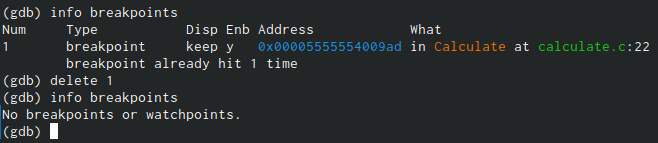

---
# Front matter
lang: ru-RU
title: "Отчет по лабораторной работе №14"
subtitle: "Дисциплина: Операционные системы"
author: "Чекалова Лилия Руслановна, ст.б. 1032201654"

# Formatting
toc-title: "Содержание"
toc: true # Table of contents
toc_depth: 2
lof: true # List of figures
fontsize: 12pt
linestretch: 1.5
papersize: a4paper
documentclass: scrreprt
polyglossia-lang: russian
polyglossia-otherlangs: english
mainfont: PT Serif
romanfont: PT Serif
sansfont: PT Sans
monofont: PT Mono
mainfontoptions: Ligatures=TeX
romanfontoptions: Ligatures=TeX
sansfontoptions: Ligatures=TeX,Scale=MatchLowercase
monofontoptions: Scale=MatchLowercase
indent: true
pdf-engine: lualatex
header-includes:
  - \linepenalty=10 # the penalty added to the badness of each line within a paragraph (no associated penalty node) Increasing the value makes tex try to have fewer lines in the paragraph.
  - \interlinepenalty=0 # value of the penalty (node) added after each line of a paragraph.
  - \hyphenpenalty=50 # the penalty for line breaking at an automatically inserted hyphen
  - \exhyphenpenalty=50 # the penalty for line breaking at an explicit hyphen
  - \binoppenalty=700 # the penalty for breaking a line at a binary operator
  - \relpenalty=500 # the penalty for breaking a line at a relation
  - \clubpenalty=150 # extra penalty for breaking after first line of a paragraph
  - \widowpenalty=150 # extra penalty for breaking before last line of a paragraph
  - \displaywidowpenalty=50 # extra penalty for breaking before last line before a display math
  - \brokenpenalty=100 # extra penalty for page breaking after a hyphenated line
  - \predisplaypenalty=10000 # penalty for breaking before a display
  - \postdisplaypenalty=0 # penalty for breaking after a display
  - \floatingpenalty = 20000 # penalty for splitting an insertion (can only be split footnote in standard LaTeX)
  - \raggedbottom # or \flushbottom
  - \usepackage{float} # keep figures where there are in the text
  - \floatplacement{figure}{H} # keep figures where there are in the text
---

# Цель работы

Приобретение простейших навыков разработки, анализа, тестирования и отладки приложений в ОС типа UNIX/Linux на примере создания на языке программирования C калькулятора с простейшими функциями.

# Выполнение лабораторной работы

Создаю в домашнем каталоге подкаталог work/os/lab_prog командой mkdir -p и перехожу в этот каталог командой cd (рис. -@fig:001)

{ #fig:001 width=70% }

Создаю файлы calculate.c, calculate.h и main.c командой touch (рис. -@fig:002)

{ #fig:002 width=70% }

Описываю в файле calculate.h формат вызова функции-калькулятора (рис. -@fig:003)

{ #fig:003 width=70% }

Реализую в файле calculate.c функции калькулятора (рис. -@fig:004) (рис. -@fig:005)

{ #fig:004 width=70% }

{ #fig:005 width=70% }

Реализую в файле main.c интерфейс пользователя к калькулятору (рис. -@fig:006)

{ #fig:006 width=70% }

Произвожу компиляцию файлов с помощью gcc и создаю Makefile командой touch (рис. -@fig:007)

{ #fig:007 width=70% }

Исправляю в Makefile синтаксические ошибки: задаю значение CFLAGS и заменяю "gcc" на объявленную, но не используемую переменную CC. Makefile проверяет наличие файлов calculate.o и main.o и компилирует их под названием calcul. Если эти файлы не были найдены, он проверяет наличие файлов calculate.h, calculate.c и main.c, при их обнаружении он делает из них необходимые исполняемые файлы, в противном случае выдает сообщение об ошибке. После завершения компиляции он удаляет уже не нужные исполняемые файлы (файлы с расширением .o) (рис. -@fig:008)

{ #fig:008 width=70% }

Загружаю программу в отладчик gdb (рис. -@fig:009)

{ #fig:009 width=70% }

Запускаю программу внутри отладчика командой run (рис. -@fig:010)

{ #fig:010 width=70% }

Просматриваю исходный код (первые 9 строк) с помощью команды list (рис. -@fig:011)

{ #fig:011 width=70% }

Просматриваю исходный код с 12 по 15 строку командой List 12,15 и определенные строки не основного файла командой list с параметрами название_файла:начальная_строка,конечная_строка (рис. -@fig:012)

{ #fig:012 width=70% }

Устанавливаю точку останова на 21 строке файла calculate.c с помощью команды break (рис. -@fig:013)

{ #fig:013 width=70% }

Вывожу информацию об имеющихся в проекте точках останова командой info breakpoints (рис. -@fig:014)

{ #fig:014 width=70% }

Запускаю программу внутри отладчика, чтобы убедиться, что программа останавливается в точке останова (рис. -@fig:015)

{ #fig:015 width=70% }

Просматриваю стек вызываемых функций от начала программы до точки останова командой backtrace (рис. -@fig:016)

{ #fig:016 width=70% }

Смотрю, чему равно значение переменной Numeral на данном этапе с помощью команд print и display. Print просто выводит значение переменой, а display выводит название переменной и ее значение. В обоих случаях ее значение равно пяти (рис. -@fig:017)

{ #fig:017 width=70% }

Удаляю точку останова командой delete 1 и проверяю успешность удаления с помощью info breakpoints (рис. -@fig:018)

{ #fig:018 width=70% }

Анализирую код файла calculate.c с помощью утилиты splint. Она вывела 15 предупреждений о неточностях и несовпадениях в коде (рис. -@fig:019)

{ #fig:019 width=70% }

Анализирую код файла main.c с помощью той же утилиты. Она вывела 4 предупреждения о неточностях в коде (рис. -@fig:020)

{ #fig:020 width=70% }

# Выводы

После выполнения данной лабораторной работы я научилась реализовывать простейший калькулятор, компилировать программы, производить отладку программы в GDB и анализировать программу с помощью утилиты splint.

# Библиография

1. Теоретические материалы к лабораторной работе: https://esystem.rudn.ru/pluginfile.php/1142241/mod_resource/content/2/011-lab_prog.pdf