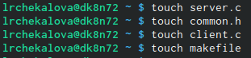
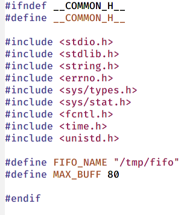
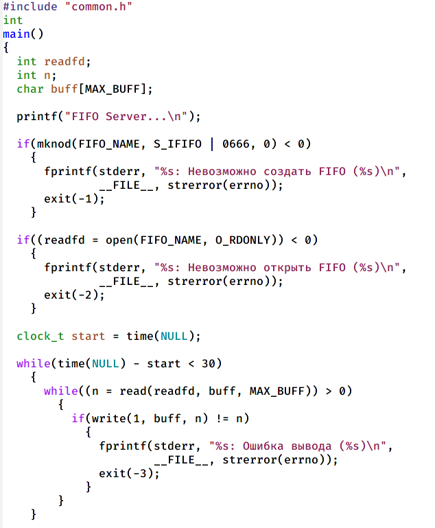
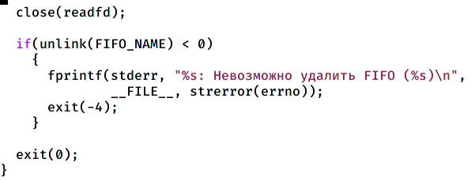
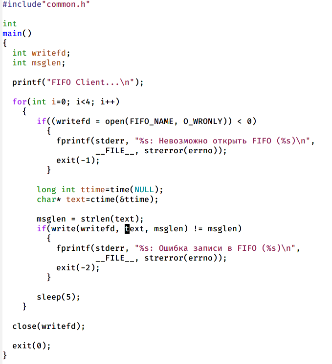
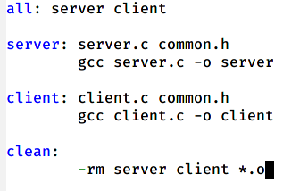
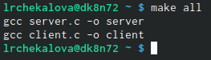
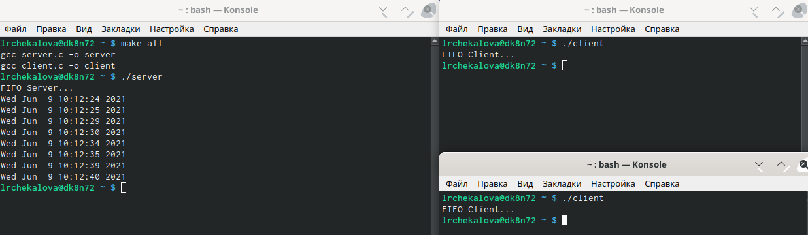

---
# Front matter
lang: ru-RU
title: "Отчет по лабораторной работе №15"
subtitle: "Дисциплина: Операционные системы"
author: "Чекалова Лилия Руслановна, ст.б. 1032201654"

# Formatting
toc-title: "Содержание"
toc: true # Table of contents
toc_depth: 2
lof: true # List of figures
fontsize: 12pt
linestretch: 1.5
papersize: a4paper
documentclass: scrreprt
polyglossia-lang: russian
polyglossia-otherlangs: english
mainfont: PT Serif
romanfont: PT Serif
sansfont: PT Sans
monofont: PT Mono
mainfontoptions: Ligatures=TeX
romanfontoptions: Ligatures=TeX
sansfontoptions: Ligatures=TeX,Scale=MatchLowercase
monofontoptions: Scale=MatchLowercase
indent: true
pdf-engine: lualatex
header-includes:
  - \linepenalty=10 # the penalty added to the badness of each line within a paragraph (no associated penalty node) Increasing the value makes tex try to have fewer lines in the paragraph.
  - \interlinepenalty=0 # value of the penalty (node) added after each line of a paragraph.
  - \hyphenpenalty=50 # the penalty for line breaking at an automatically inserted hyphen
  - \exhyphenpenalty=50 # the penalty for line breaking at an explicit hyphen
  - \binoppenalty=700 # the penalty for breaking a line at a binary operator
  - \relpenalty=500 # the penalty for breaking a line at a relation
  - \clubpenalty=150 # extra penalty for breaking after first line of a paragraph
  - \widowpenalty=150 # extra penalty for breaking before last line of a paragraph
  - \displaywidowpenalty=50 # extra penalty for breaking before last line before a display math
  - \brokenpenalty=100 # extra penalty for page breaking after a hyphenated line
  - \predisplaypenalty=10000 # penalty for breaking before a display
  - \postdisplaypenalty=0 # penalty for breaking after a display
  - \floatingpenalty = 20000 # penalty for splitting an insertion (can only be split footnote in standard LaTeX)
  - \raggedbottom # or \flushbottom
  - \usepackage{float} # keep figures where there are in the text
  - \floatplacement{figure}{H} # keep figures where there are in the text
---

# Цель работы

Приобретение практических навыков работы с именованными каналами.

# Выполнение лабораторной работы

Создаю файлы client.c, common.h, server.c и makefile командой touch (рис. -@fig:001)

{ #fig:001 width=70% }

Записываю в файл common.h используемые в ходе работы библиотеки из шаблонного файла, добавляю библиотеки time.h и unistd.h (рис. -@fig:002)

{ #fig:002 width=70% }

Описываю в файле server.c работу сервера: создание файла FIFO, открытие его на чтение, чтение данных из файла в течение 30 секунд, закрытие файла и удаление его из системы (рис. -@fig:003) (рис. -@fig:004)

{ #fig:003 width=70% }

{ #fig:004 width=70% }

Реализую в файле client.c работу клиента: получение доступа к FIFO, подсчет времени, передача сообщения серверу, приостановка работы на некоторое время и закрытие доступа к файлу (рис. -@fig:005)

{ #fig:005 width=70% }

 Описываю правила компиляции файлов в Makefile (рис. -@fig:006)

{ #fig:006 width=70% }

Произвожу компиляцию файлов с помощью Makefile командой make all (рис. -@fig:007)

{ #fig:007 width=70% }

Открываю три окна консоли, в первом запускаю сервер, в остальных - клиенты. Окно с сервером выводит информацию о работе клиентов и прекращает работу через 30 секунд. В случае, если канал не будет закрыт, мы не сможем создать еще один, так как он уже существует (рис. -@fig:008)

{ #fig:008 width=70% }

# Выводы

После выполнения данной лабораторной работы я научилась работать с именованными каналами, организовывать работу с несколькими клиентами, реализовывать периодичность работы с помощью команды sleep() и определять время работы программы.

# Библиография

1. Теоретические материалы к лабораторной работе: https://esystem.rudn.ru/pluginfile.php/1142244/mod_resource/content/1/013-ipc-fifo.pdf
